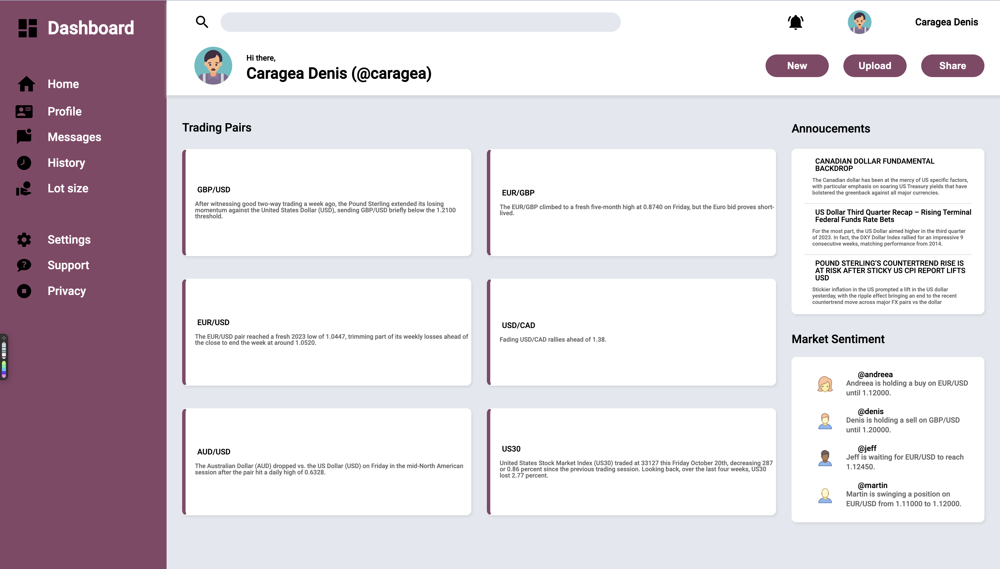
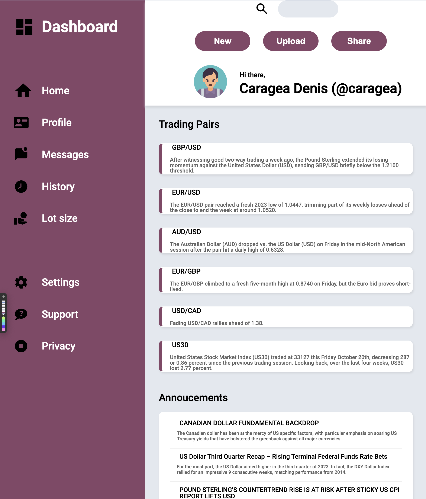

	<h1>Admin dashboard
	 
		
		
		 
	</h1>
	<h3><b><a href="https://carageadenis1806.github.io/admin_dashboard/">View Live Demo</a></b></h3>

## Description

This is an Admin Dashboard created as part of [TheOdinProject](https://www.theodinproject.com) curriculum.

To see the assignment details - [Click Here](https://www.theodinproject.com/lessons/node-path-intermediate-html-and-css-admin-dashboard)

## Built Using

-   HTML5 
-   CSS3 (using concepts like Grid, Flexbox etc)

## Gallery

#### Home Page

#### Tablet View

#### Mobile View

